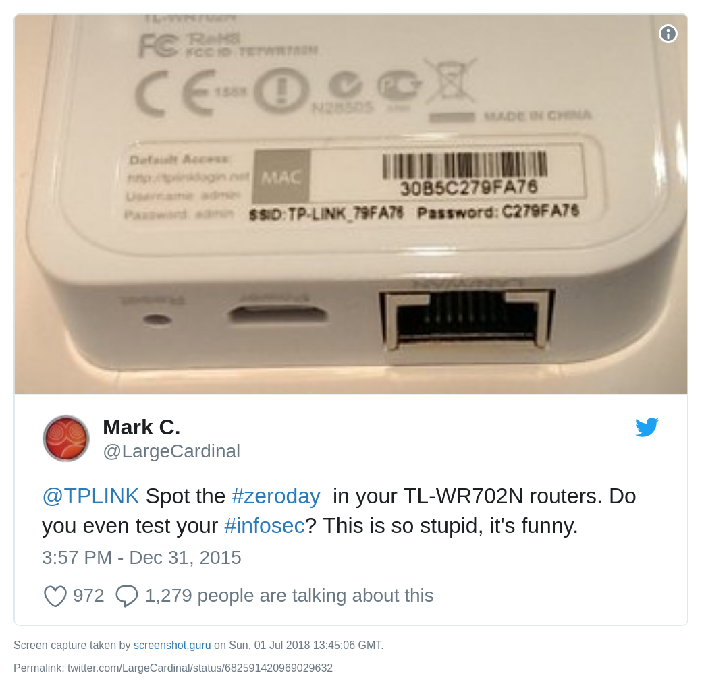

# TP-Link-defaults

Python script for trying default passwords for some TP-Link Hotspots

Inspired by 

## Usage

    usage: scan.py [-h] [-p] [-t TIMEOUT]

    Python script for trying default passwords for some TP-Link Hotspots

    optional arguments:
    -h, --help            show this help message and exit
    -p, --print-all       print all found ssid's
    -t TIMEOUT, --timeout TIMEOUT

    FOR EDUCATIONAL USE ONLY

## Config

-   `timeout` stop sniffing after a given time
-   `print_all` print all found ssid's

## License

[MIT License](LICENSE)

